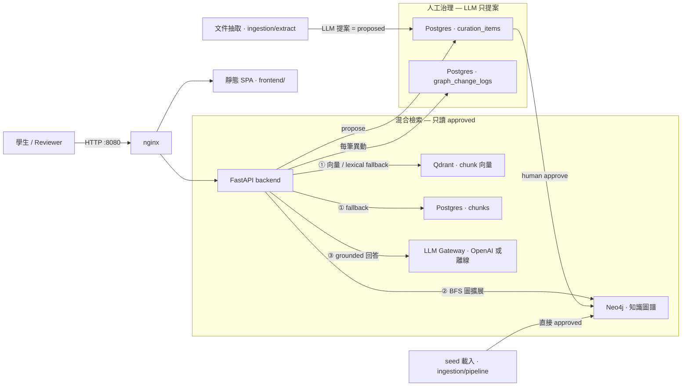
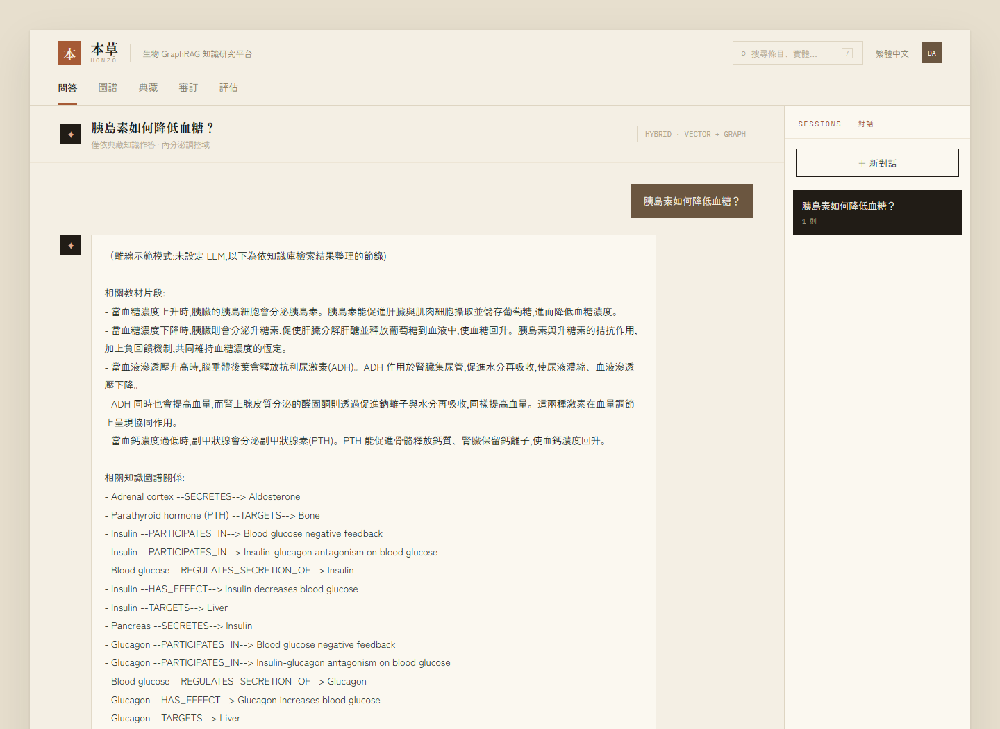
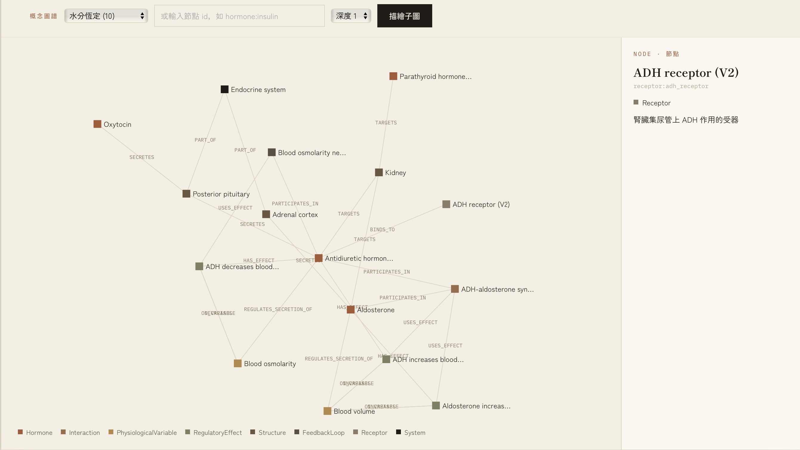
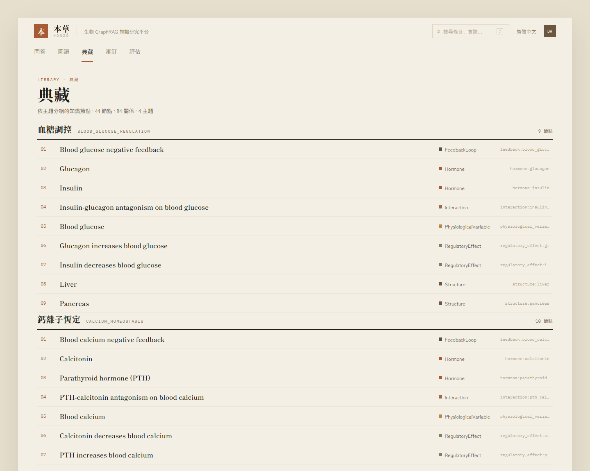
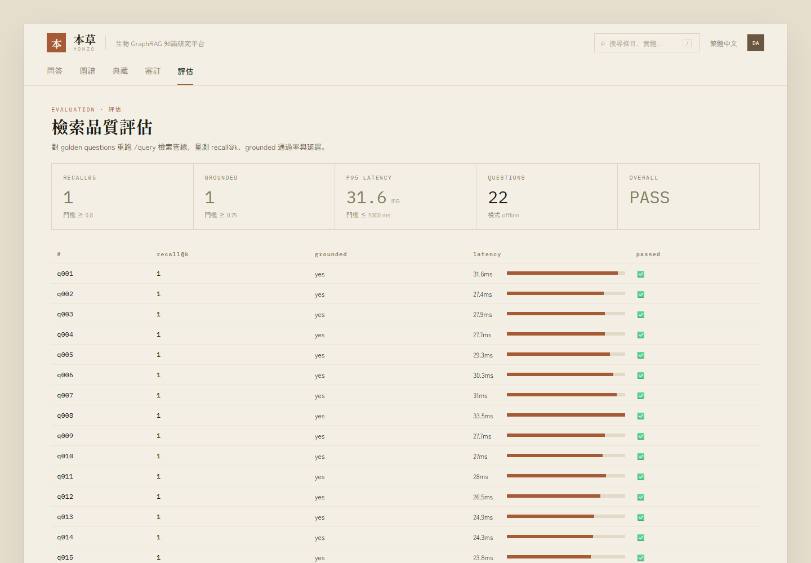

# Biology GraphRAG Tutor

[](https://github.com/busybutlazy/bio_graphrag/actions/workflows/ci.yml)

Domain-specific GraphRAG system for high-school biology. See `docs/graph_plan.md` for the full project plan and phase breakdown, `schema/` for the graph/DB schema, and `docs/api_contract.md` for the API contract.

## The one idea

A GraphRAG biology tutor built around a single invariant: **an LLM only ever *proposes* knowledge — nothing reaches a student until a human approves it, and the unapproved is provably invisible.** All student-facing retrieval reads only `status='approved'` nodes/edges (enforced in `app/graph/cypher_templates.py`), so a proposed-but-unapproved fact cannot surface in any answer. Review is split into two independent gates — an **engineer gate** for *form* (schema, pattern, testability) and an **expert gate** for *meaning* (is the biology actually right?) — because "valid JSON" is not "correct biology".

The domain expert behind that second gate is real: I taught high-school biology before moving into software engineering, and I reviewed the biology in this graph myself. The project is the bridge — using the old expertise to prove the new one.

### Governance walkthrough (all of it runs)

1. **Ask** — a student question returns a grounded answer from the approved graph (`POST /query`, 問答 screen).
2. **Propose** — ingest a chapter; the LLM proposes nodes/edges that land as `proposed` in the curation queue (`POST /admin/ingest/run`, or 審訂 create) — never written to the live graph.
3. **Prove invisible** — re-ask the same question; the just-proposed graph fact does **not** appear, because retrieval filters on `status='approved'`.
4. **Two gates** — the 審閱 (Expert Review) screen runs each proposal through the engineer gate (form) then the expert gate (meaning). It includes a case that *passes* form but is **rejected for wrong biology** (reversed direction), and a case *rejected at the form gate* — proving the gates are independent (`GET /admin/expert-demo/cases`).
5. **Approve** — a human approves; the node is written to Neo4j as `approved` (`POST /admin/curation/items/{id}/approve`).
6. **Re-ask + audit** — the answer now includes it, and every decision (curation *and* expert review) is an append-only row in `graph_change_logs` with actor, action, and reason (`POST /admin/expert-demo/reviews` records expert-gate decisions).

## Architecture

Four datastores, each with one job; all student-facing retrieval reads **only `status='approved'`** knowledge, and an LLM only ever *proposes* graph changes — a human approves them before they reach retrieval.



- **Hybrid retrieval** (`app/rag/pipeline.py`): vector/lexical search over chunks → collect `concept_ids` → BFS the approved Neo4j subgraph (depth-limited, node-capped) → compose grounded context → LLM answer.
- **Governance** (`app/curation/service.py`): propose → `curation_items` queue → human approve writes into Neo4j as `approved`; every mutation is appended to `graph_change_logs`.
- **Offline mode**: with no `OPENAI_API_KEY`, retrieval falls back to lexical bigram search and answers are extractive — a fresh clone runs every screen with no secrets.

## Quick Start

```bash
cp .env.example .env
make up
make health
make seed
# then open the demo UI:
open http://localhost:8080/        # served via nginx → FastAPI backend
```

`make seed` loads seed data into Neo4j, Qdrant, and PostgreSQL — safe to re-run. It reads from `data/seed/` if present (your real exported knowledge); otherwise falls back to the public demo data in `data/sample/` (44 nodes / 84 relationships, 8 chunks — enough to run all screens without any API key).

## Demo UI

A static single-page UI (vanilla HTML/CSS/JS, no build step) is served at `http://localhost:8080/` (nginx → FastAPI backend) — every screen is backed by a real endpoint, over the actual sample endocrine graph. The visual system reuses a supplied design handoff (本草 HONZŌ). Five screens:

| Screen | Endpoint(s) | What it shows |
|---|---|---|
| **問答 Chat** | `POST /query` | Hybrid retrieval Q&A: grounded answer + citation chips + supporting nodes + relationships. Deep-link a question: `/?ask=...#chat` |
| **圖譜 Graph** | `GET /neighbors`, `POST /concept-map` | Force-directed subgraph of a node or topic; click a node for detail. Deep-link: `/?node=hormone:insulin#graph` |
| **典藏 Library** | `GET /library` | Approved nodes grouped by topic; click through to the graph |
| **審訂 Curation** | `GET/POST /admin/curation/*` | Human-in-the-loop: propose a node/edge → review queue → approve/reject into the graph |
| **審閱 Expert Review** | `GET /admin/expert-demo/cases` | Governance demo: AI proposal → engineer gate (form) → deterministic back-translation → expert gate (meaning, no JSON) → schema-gap backlog → gold regression. See `docs/expert-in-the-loop-workflow.md` |
| **評估 Evaluation** | `GET /admin/evaluation/latest` | Live recall@k / grounded / P95-latency dashboard over the golden questions |

With no `OPENAI_API_KEY` the demo runs fully offline (lexical retrieval + an extractive, clearly-labelled answer), so a fresh clone works with no secrets.






## API

All request limits (question length, `top_k`, `graph_depth`, returned nodes/chunks) are enforced by request validation — oversized params return `422`. There is no arbitrary-Cypher or bulk-export endpoint. See `docs/api_contract.md` for full schemas.

```bash
# Hybrid retrieval Q&A (vector search + graph expansion + grounded answer)
curl -X POST http://localhost:8080/query -H "Content-Type: application/json" \
  -d '{"question":"胰島素如何降低血糖?","top_k":5,"graph_depth":1}'

# Single approved node
curl "http://localhost:8080/nodes/interaction:insulin_glucagon_blood_glucose"

# Local subgraph
curl "http://localhost:8080/neighbors/hormone:insulin?depth=1"

# Concept map from node ids or a topic
curl -X POST http://localhost:8080/concept-map -H "Content-Type: application/json" \
  -d '{"topic":"blood_glucose_regulation","depth":1}'

# Check a student's answer for misconceptions
curl -X POST http://localhost:8080/check-answer -H "Content-Type: application/json" \
  -d '{"question":"血糖如何調節?","student_answer":"胰島素降低血糖,升糖素提高血糖。"}'
```

`/query` and `/check-answer` call an LLM through a provider-agnostic gateway (`app/llm/gateway.py`). With `OPENAI_API_KEY` set, retrieval uses OpenAI embeddings + chat; **without a key the demo runs fully offline** — lexical bigram retrieval plus an extractive, clearly-labelled answer — so a fresh clone works with no secrets.

Retrieval only ever reads `status = 'approved'` nodes/edges. New nodes/edges go through human curation first:

```bash
curl -X POST http://localhost:8080/admin/curation/items \
  -H "Content-Type: application/json" \
  -d '{"item_type":"node","action":"create","payload":{"id":"hormone:example","type":"Hormone","label":"Example","description":"..."},"reason":"why"}'

curl -X POST http://localhost:8080/admin/curation/items/curation:hormone:example/approve \
  -H "Content-Type: application/json" -d '{"reviewer":"you","reason":"looks correct"}'
```

Every approve/reject/merge/delete is recorded in `graph_change_logs` with actor, action, and reason.

### Document ingestion (LLM extraction)

`make seed` loads a hand-curated graph (or your real exported knowledge). The **document ingestion** path instead takes a raw chapter file and uses an LLM to *propose* nodes/edges, which then go through the same human curation before they reach the approved graph. Chapter files are markdown with a YAML-style front-matter block:

```markdown
---
doc_id: doc:sample:hormone_regulation_demo
title: 激素與體內恆定
topic: blood_glucose_regulation
grade_level: 高二
source_type: sample
extraction_profile: endocrine   # optional; overlays prompts/profiles/<name>.profile.md
---
# 激素與體內恆定
…章節內文…
```

Public demo chapters live in `data/sample/chapters/`; real chapters go in `data/private/chapters/` (gitignored IP). The pipeline is: `parse → chunk → per-chunk (existing-concept lookup → prompt → LLM extract → schema-validate → stage as proposed) → write chunks/embeddings → job log`. Chunks are written immediately and reference the freshly-proposed concept ids; retrieval still only reads `approved` nodes, so nothing surfaces to students until a human approves it.

Three admin endpoints — **the interface is public, the action is locked**:

```bash
# 1. See chunk strategies, params, profiles, and ingestable source files
curl http://localhost:8080/admin/ingest/options

# 2. Dry-run preview: chunk + assemble the exact prompts, ZERO token spend, no writes
curl -X POST http://localhost:8080/admin/ingest/preview -H "Content-Type: application/json" \
  -d '{"source":"data/sample/chapters/demo.md","strategy":"markdown_header"}'

# 3. Real run: spends tokens + stages proposed knowledge — owner-token locked
curl -X POST http://localhost:8080/admin/ingest/run -H "Content-Type: application/json" \
  -H "X-Ingest-Owner-Token: <your-secret>" \
  -d '{"source":"data/sample/chapters/demo.md","strategy":"recursive","chunk_params":{"chunk_size":500,"chunk_overlap":80}}'
```

Three chunk strategies are selectable per request: `fixed` (fixed characters + overlap), `recursive` (paragraph/sentence-hierarchy splitting, size-controlled), and `markdown_header` (split on `#`/`##`/`###`, oversized sections fall back to recursive). The chosen strategy and params are recorded in `ingestion_jobs.stats`.

**Two-layer auth on purpose.** `options` and `preview` need only an admin key, so an interviewer can explore every strategy and see the assembled prompts for free. `run` additionally requires `X-Ingest-Owner-Token` matching `INGEST_OWNER_SECRET` — **closed by default** (empty secret locks it for everyone). Real extraction also needs `OPENAI_API_KEY`; without it `run` returns a clean `llm_not_configured` error instead of staging nothing.

### Securing `/admin`

The `/admin/*` endpoints (curation + evaluation) accept a named API key. Configure keys as a comma-separated `vendor:key` list:

```bash
# .env
ADMIN_API_KEYS=acme:key1,globex:key2
```

Requests must then send `X-API-Key: key1`; the matched vendor name is attributed to the action. **When `ADMIN_API_KEYS` is empty (the default) auth is disabled**, so a fresh clone and the test suite run open — set it in any exposed deployment. The demo UI reads its key from `localStorage.setItem('adminApiKey', '<key>')`.

### Per-company access & token quotas

The token-spending tutor endpoints (`POST /query`, `POST /check-answer`) are gated per company so a shared demo can't burn tokens uncontrolled. Browsing (library / graph / node detail) stays open — no login needed.

- **Closed by default.** With no account (or an unknown/expired/disabled/over-quota key) the token endpoints return a structured error and stay closed. There is no "open when unconfigured" fallback — safe for a public deployment.
- Accounts live in the `vendors` table, hand-maintained via a small CLI:

  ```bash
  docker compose exec backend python -m scripts.manage_vendors \
      add --code acme --name "Acme Corp" --quota 50000 --expires 2026-08-01
  docker compose exec backend python -m scripts.manage_vendors list      # api_key shown masked
  docker compose exec backend python -m scripts.manage_vendors update --code acme --quota 100000
  docker compose exec backend python -m scripts.manage_vendors disable --code acme
  ```

  `--quota` is required (non-negative integer; `0` = no token access). The `api_key` is auto-generated and printed once on `add`; give it to the company. Usage (embedding + completion tokens) is tallied per request in `vendor_usage` and checked against the quota; the quota is a **soft cap** — it is checked at the *start* of a request, so both concurrent requests and the single request that crosses the threshold can overshoot by up to roughly one request's worth of tokens.
- Companies log in from the header control (the key is sent as `X-API-Key`, stored in `localStorage`). Errors use `{"error": {"code", "message"}}` — the UI maps `login_required` / `quota_exceeded` / `account_expired` / `account_disabled` to a prompt while browsing keeps working.

> These are **demo-grade access keys**: `api_key` is stored in plaintext and the `X-API-Key` header is never written to logs, but this is not a production credential store (no hashing, rotation, or per-vendor rate limiting). Per-vendor accounts here replace the earlier "deferred" note; hardening the store remains future work.
>
> The vendor key is a **low-value, disposable credential** (worst case if leaked: that company's token quota is spent — it cannot mutate the graph or reach `/admin`). A static SPA must keep the key somewhere its own JS can read, so making it un-stealable would require a server-side session layer that is out of scope here. The security posture is therefore **blast-radius control, not prevention** — the per-vendor quota, expiry, and `disable` switch bound the damage — plus **enabling TLS on any exposed deployment** so the header isn't sniffable in transit.

## Tests

```bash
make test
```

## Evaluation

```bash
make eval
```

Replays 22 golden questions (`data/sample/sample_questions.json`) through the
`/query` retrieval pipeline and scores retrieval recall@k, grounded-answer pass
rate, and latency against fixed thresholds (recall@5 ≥ 0.8, grounded ≥ 0.75, P95
≤ 5s). Results persist to `evaluation_runs`/`evaluation_items` and a Markdown/JSON
report; the command gates on the thresholds so it can run in CI. Methodology and
an honest reading of the numbers are in `docs/evaluation.md`.

## Project Layout

- `backend/` — FastAPI service (served via nginx on port 8080)
- `ingestion/` — two paths: `pipeline/` seed loader (structured JSON → Neo4j/Qdrant/Postgres, `make seed`) and `extract/` document ingestion (raw chapter → chunk → LLM extract → staged for curation)
- `schema/` — Neo4j node/relationship types, DB schema, LLM extraction guidelines
- `prompts/` — public LLM extraction base template; per-chapter profile overlays (`prompts/profiles/*.profile.md`) stay local (gitignored) as IP — see `prompts/profiles/README.md`
- `docs/` — project plan and API contract
- `scripts/` — helper scripts (`wait_for_services.sh`; `manage_vendors.py` vendor-account CLI; `export_seed.py` DB→seed exporter)
- `data/sample/` — public demo seed: hormone-regulation concepts/edges/documents/chunks JSON; `data/sample/chapters/` demo chapter (real chapters live in gitignored `data/private/chapters/`)
- `data/seed/` — **gitignored** real exported knowledge; populated by `make export-seed`; takes priority over `data/sample/` when present; copy manually when switching machines

### Seed priority

`make seed` auto-detects which data to load:

| Directory | Source | When present |
|---|---|---|
| `data/seed/` | `make export-seed` snapshot of your real DB | Takes priority — your real extracted knowledge |
| `data/sample/` | Public demo data (committed) | Fallback — always present for a fresh clone |

**Workflow for switching machines:** run `make export-seed` on the source machine → copy `data/seed/` → run `make seed` on the target.
