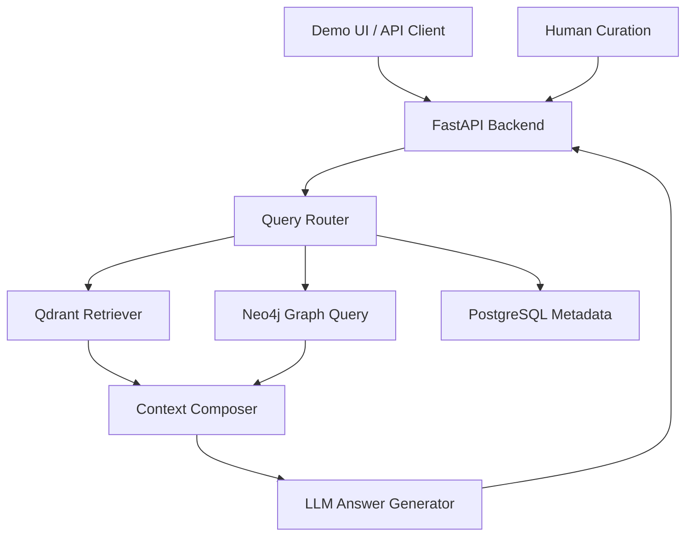

# 高中生物 GraphRAG 履歷專案計畫書

## 1. 專案定位

本專案目標不是單純做一個 RAG demo，而是建立一個可公開展示的 domain-specific GraphRAG 系統，用來呈現以下能力：

- 能將領域知識轉換成可維護的知識圖譜。
- 能整合 Graph DB、Vector DB、PostgreSQL 與 FastAPI，形成完整後端服務。
- 能用 Docker 建立可重現的開發、測試與 demo 環境。
- 能透過測試與評估指標證明系統不是只有「可以跑」，而是具備可驗證品質。
- 能將完整知識資產保留在私有環境，只公開 code、schema、sample data 與受控 API。

專案建議名稱：

```text
biology-graphrag-tutor
```

履歷上的一句話定位：

```text
Domain-specific GraphRAG system for high-school biology, combining curated concept graph, hybrid retrieval, node-level grounding, and controlled public API over private knowledge assets.
```

中文描述：

```text
建立高中生物知識圖譜與 GraphRAG 問答系統，支援概念關係查詢、局部子圖檢索、先備知識導覽、答案出處 grounding 與錯誤觀念檢查；公開 repo 展示架構與 sample graph，完整知識庫則透過受控 API 提供 demo。
```

## 2. 核心原則

### 2.1 公開 infra，不公開完整知識資產

公開 GitHub repo 應包含：

- backend API code
- graph schema
- ingestion pipeline
- retrieval pipeline
- sample mini graph
- test cases
- docker-compose
- README / architecture note / API docs

不應公開：

- 完整高中生物知識圖譜
- raw notes / source chunks
- embeddings / vector index artifacts
- Neo4j、Qdrant、PostgreSQL credentials
- OpenAI API key 或任何 LLM provider key

### 2.2 使用者只能透過 API，不直接連 DB

正確存取路徑：

```text
User / Demo UI
  -> FastAPI Backend
  -> controlled query templates
  -> Neo4j / Qdrant / PostgreSQL
  -> grounded answer
```

避免：

```text
User -> Neo4j
User -> Qdrant
User -> arbitrary Cypher endpoint
```

### 2.3 履歷專案要重視「可驗證」

每個階段都需要：

- Builder：負責實作。
- Tester：負責寫測試、跑測試、記錄失敗案例。
- Reviewer：負責審查架構、命名、安全、文件與是否符合履歷展示目標。

這三個角色可以由同一個人或不同 agent 執行，但責任要分開。

### 2.4 LLM 只負責提案，知識圖譜需要人工治理

好的知識圖譜不應完全依賴 LLM 自動生成。LLM 可以協助抽取候選節點、候選關係與候選說明，但正式進入查詢用 graph 前，應保留人工審核與人工修正空間。

建議原則：

```text
LLM extraction -> proposed graph changes -> human review -> approved graph -> retrieval
```

也就是說：

- LLM 產生的是 draft / proposed graph。
- 人可以新增節點、補關係、刪除多餘節點、合併同義概念、調整關係類型。
- 只有 approved 狀態的節點與關係會進入正式 GraphRAG retrieval。
- 每次人工修改都要保留 provenance 與 change log，方便追蹤知識圖譜品質。

## 3. 建議技術架構

### 3.1 系統元件

| Layer | 技術 | 職責 |
|---|---|---|
| Frontend | React / Next.js | demo UI，第一階段可先放設計稿與 API mock，不必完整實作 |
| Backend | FastAPI | 統一 API、權限控管、query orchestration、response formatting |
| Curation Layer | FastAPI admin endpoints / JSON review files | 人工審核 LLM 產生的候選節點與關係，支援新增、刪除、合併與批准 |
| Graph DB | Neo4j | 儲存概念節點、關係、先備知識、局部子圖 |
| Vector DB | Qdrant | 儲存 chunk embeddings，支援語意檢索 |
| Relational DB | PostgreSQL | 儲存文件 metadata、ingestion job、query logs、evaluation records |
| LLM Layer | OpenAI / local model adapter | 產生回答、錯誤觀念檢查、概念圖摘要 |
| Test Runner | pytest | unit / integration / API / evaluation tests |
| Container | Docker Compose | 本機一鍵啟動 backend、Neo4j、Qdrant、PostgreSQL、test runner |

### 3.2 MVP 架構圖



### 3.3 Repo 結構

```text
biology-graphrag-tutor/
  README.md
  docker-compose.yml
  .env.example
  Makefile

  backend/
    app/
      main.py
      api/
        routes_query.py
        routes_nodes.py
        routes_health.py
      core/
        config.py
        security.py
        logging.py
      rag/
        retriever_vector.py
        retriever_graph.py
        context_composer.py
        answer_generator.py
      graph/
        schema.py
        cypher_templates.py
      db/
        postgres.py
        models.py
      eval/
        metrics.py
    tests/
      unit/
      integration/
      api/

  ingestion/
    pipeline/
      parse_source.py
      normalize_concepts.py
      build_graph.py
      build_chunks.py
      embed_chunks.py
      load_neo4j.py
      load_qdrant.py
      load_postgres.py
    tests/

  frontend/
    README.md
    design/
    mock/

  data/
    sample/
      biology_sample_concepts.json
      biology_sample_edges.json
      biology_sample_chunks.json
      sample_questions.json

  schema/
    graph_schema.md
    node_types.md
    relationship_types.md
    extraction_guidelines.md
    extraction_output_schema.json

  prompts/
    graph_extraction_prompt.md

  docs/
    architecture.md
    api_contract.md
    security.md
    evaluation.md
    resume_notes.md

  scripts/
    wait_for_services.sh
    seed_sample_data.sh
    run_tests.sh
```

## 4. 資料模型規劃

### 4.1 Neo4j Node Types

| Node Type | 用途 | 範例 |
|---|---|---|
| Concept | 一般概念 | Homeostasis、Photosynthesis |
| System | 生物系統 | Endocrine system、Immune system |
| Process | 生理或分子流程 | Glycolysis、Negative feedback |
| Structure | 結構 | Pancreas、Mitochondria |
| Molecule | 分子 | Insulin、Glucose、ATP |
| Hormone | 激素 | Glucagon、ADH |
| Receptor | 受器 | Insulin receptor、ADH receptor |
| PhysiologicalVariable | 被調控的生理變因 | Blood glucose、Blood osmolarity、Blood calcium |
| RegulatoryEffect | 某個調控者對某個生理變因造成的效果 | Insulin lowers blood glucose |
| Interaction | 描述兩個或多個激素效果如何共同影響同一個生理變因，例如拮抗作用或協同作用。 | Insulin and glucagon antagonism on blood glucose |
| FeedbackLoop | 回饋迴路 | Blood glucose negative feedback loop |
| Enzyme | 酵素 | Amylase、DNA polymerase |
| Disease | 疾病或異常 | Diabetes mellitus |
| Experiment | 經典實驗 | Hershey-Chase experiment |
| Misconception | 常見錯誤觀念 | Insulin directly digests glucose |

### 4.2 Neo4j Relationship Types

| Relationship | 意義 | 範例 |
|---|---|---|
| PART_OF | 組成關係 | Mitochondria PART_OF Cell |
| SECRETES | 分泌 | Pancreas SECRETES Insulin |
| SECRETED_BY | 分泌來源 | Insulin SECRETED_BY Pancreas |
| BINDS_TO | 激素與受器結合 | Insulin BINDS_TO Insulin receptor |
| TARGETS | 作用目標 | Insulin TARGETS Liver |
| HAS_EFFECT | 調控者具有某個調控效果 | Insulin HAS_EFFECT Insulin lowers blood glucose |
| ON_VARIABLE | 調控效果作用於某個生理變因 | Insulin lowers blood glucose ON_VARIABLE Blood glucose |
| INCREASES | 調控效果提高某個變因 | Glucagon raises blood glucose INCREASES Blood glucose |
| DECREASES | 調控效果降低某個變因 | Insulin lowers blood glucose DECREASES Blood glucose |
| REGULATES_SECRETION_OF | 生理變因調節激素分泌 | High blood glucose REGULATES_SECRETION_OF Insulin |
| PARTICIPATES_IN | 節點參與某個交互作用或回饋迴路 | Insulin PARTICIPATES_IN Blood glucose negative feedback |
| USES_EFFECT | 高階互動由哪些調控效果構成 | Antagonism USES_EFFECT Insulin lowers blood glucose |
| CATALYZES | 催化 | Amylase CATALYZES Starch breakdown |
| PREREQUISITE_OF | 先備知識 | Cell membrane PREREQUISITE_OF Osmosis |
| CAUSES | 導致 | Insulin deficiency CAUSES Hyperglycemia |
| EVIDENCED_BY | 實驗支持 | DNA as genetic material EVIDENCED_BY Hershey-Chase |
| COMMONLY_CONFUSED_WITH | 常混淆 | Mitosis COMMONLY_CONFUSED_WITH Meiosis |

建模原則：

```text
Hormone -> HAS_EFFECT -> RegulatoryEffect -> ON_VARIABLE -> PhysiologicalVariable
Interaction -> USES_EFFECT -> RegulatoryEffect
FeedbackLoop -> USES_EFFECT -> RegulatoryEffect
```

不建議只用：

```text
Insulin -> ANTAGONISTIC_TO -> Glucagon
```

因為這會遺失「在哪個生理變因上拮抗」以及「兩者各自造成什麼方向的效果」。較好的表示方式是：

```text
Insulin -> HAS_EFFECT -> Insulin lowers blood glucose -> DECREASES -> Blood glucose
Glucagon -> HAS_EFFECT -> Glucagon raises blood glucose -> INCREASES -> Blood glucose
Antagonism interaction -> USES_EFFECT -> Insulin lowers blood glucose
Antagonism interaction -> USES_EFFECT -> Glucagon raises blood glucose
Antagonism interaction -> ON_VARIABLE -> Blood glucose
```

其中 `Interaction` 建議使用屬性標示類型，例如：

```json
{
  "id": "interaction:insulin_glucagon_blood_glucose",
  "type": "Interaction",
  "interaction_type": "antagonism",
  "scope": "blood_glucose_regulation"
}
```

`FeedbackLoop` 也建議使用屬性標示正回饋或負回饋：

```json
{
  "id": "feedback:blood_glucose_negative_feedback",
  "type": "FeedbackLoop",
  "feedback_type": "negative",
  "regulated_variable": "blood_glucose"
}
```

### 4.3 PostgreSQL Tables

| Table | 用途 |
|---|---|
| documents | 文件或章節 metadata |
| chunks | chunk metadata，不存完整私有原文於 public sample 之外 |
| ingestion_jobs | ingestion 執行紀錄 |
| curation_items | LLM 或人提出的候選節點、候選關係與修改建議 |
| graph_change_logs | 人工新增、刪除、合併、批准、拒絕的操作紀錄 |
| graph_versions | graph schema 或資料版本紀錄，方便 rollback 與比較 |
| query_logs | demo 查詢紀錄、latency、retrieval result |
| evaluation_runs | 評估批次 |
| evaluation_items | 單題評估結果 |

### 4.4 Qdrant Collections

建議 collection：

```text
biology_chunks
```

payload 欄位：

| Field | 用途 |
|---|---|
| chunk_id | 對應 PostgreSQL chunks |
| doc_id | 文件或章節 ID |
| concept_ids | 相關 Neo4j concept IDs |
| topic | 主題 |
| grade_level | 高中一、二、三或通用 |
| source_type | textbook_note / curated_note / sample |
| visibility | public_sample / private_full |

## 5. API 規劃

### 5.1 第一階段必做 API

| Method | Endpoint | 用途 |
|---|---|---|
| GET | /health | service health check |
| POST | /query | GraphRAG 問答 |
| GET | /nodes/{node_id} | 查詢單一節點 |
| GET | /neighbors/{node_id} | 查詢局部鄰居 |
| POST | /concept-map | 產生局部概念圖 |
| POST | /check-answer | 檢查學生回答或錯誤觀念 |

### 5.2 第一階段管理與人工審核 API

第一版不需要完整後台 UI，但應保留 API 或 JSON workflow，證明架構支援 human-in-the-loop curation。

| Method | Endpoint | 用途 |
|---|---|---|
| GET | /admin/curation/items | 查看待審核節點與關係 |
| POST | /admin/curation/items | 人工建立候選節點或候選關係 |
| POST | /admin/curation/items/{item_id}/approve | 批准候選變更並寫入 approved graph |
| POST | /admin/curation/items/{item_id}/reject | 拒絕候選變更 |
| POST | /admin/graph/merge-nodes | 合併同義或重複節點 |
| POST | /admin/graph/delete-node | 軟刪除不必要節點 |
| POST | /admin/graph/delete-edge | 軟刪除不必要關係 |

### 5.3 不應提供的 API

| Endpoint | 避免原因 |
|---|---|
| POST /cypher | 容易被任意查詢或 dump graph |
| GET /all-nodes | 容易被爬完整圖譜 |
| GET /all-edges | 容易被重建完整關係 |
| GET /export-all | 直接外洩知識資產 |
| GET /raw-source/{id} | 可能外洩完整筆記或教材 |

### 5.4 /query 回傳格式

```json
{
  "answer": "胰島素與升糖素透過負回饋共同維持血糖穩定...",
  "supporting_nodes": [
    {
      "id": "concept:insulin",
      "label": "Insulin",
      "type": "Hormone"
    }
  ],
  "relationships_used": [
    {
      "source": "Insulin",
      "relation": "DECREASES",
      "target": "Blood glucose"
    }
  ],
  "citations": [
    {
      "chunk_id": "chunk:sample:001",
      "doc_id": "doc:sample:homeostasis",
      "snippet": "..."
    }
  ],
  "retrieval_debug": {
    "vector_hits": 5,
    "graph_nodes": 8,
    "graph_depth": 1
  }
}
```

公開 demo 可以隱藏 `retrieval_debug`，README 或 local mode 才顯示。

## 6. 分階段實作計畫

### Phase 0：專案骨架與 Docker Base

目標：

- 建立 repo skeleton。
- 建立 Docker Compose。
- 建立 FastAPI health endpoint。
- 建立 Neo4j、Qdrant、PostgreSQL service。
- 建立測試執行方式。

Builder 任務：

- 建立 `docker-compose.yml`。
- 建立 backend Dockerfile。
- 建立 `.env.example`。
- 建立 `GET /health`。
- 建立 `Makefile` 或 scripts。

Tester 任務：

- 測試 `docker compose up` 可以啟動。
- 測試 `/health` 回傳 200。
- 測試 backend 能連 PostgreSQL。
- 測試 backend 能連 Neo4j。
- 測試 backend 能連 Qdrant。

Reviewer 任務：

- 檢查 secrets 是否只存在 `.env`，不得 commit。
- 檢查 `.env.example` 是否只有變數名稱與安全 placeholder。
- 檢查 README 是否能讓面試官一鍵啟動 local demo。

通過標準：

- `docker compose up -d` 成功。
- `pytest` 全數通過。
- `GET /health` 回傳所有 dependency status。
- repo 不含任何真實 key、token、DB password。

### Phase 1：Sample Biology Graph Schema

目標：

- 設計 sample graph schema。
- 建立一個小型但有代表性的高中生物主題：激素調控。
- 讓面試官看得出 graph modeling 能力。

建議 sample topic：

```text
激素調控網路：回饋調節、協同作用與拮抗作用
```

原因：

- 激素系統不是單線流程，而是典型網狀知識：腺體、激素、受器、目標器官、受調控變因與生理效果彼此交織。
- 同一激素可作用於多個目標器官，同一生理變因也可能同時受多個激素調控。
- 可自然展示正回饋、負回饋、協同作用與拮抗作用，這些正是學生容易混淆、也最適合用 graph 表示的內容。
- 血糖調控可作為第一個核心子案例，串起 insulin、glucagon、pancreas、liver、blood glucose 與 negative feedback。

第一版 sample scope：

| 子主題 | 展示重點 |
|---|---|
| 血糖調控 | 胰島素與升糖素的拮抗作用、負回饋、肝臟作為目標器官 |
| 水分恆定 | ADH、腎臟、水分再吸收、滲透壓調控 |
| 鈣離子恆定 | PTH、calcitonin、骨骼、腎臟、小腸的協同調控 |
| 生殖激素軸 | GnRH、FSH、LH、estrogen、progesterone 的階層式調控與回饋 |
| 分娩或排卵 | oxytocin 或 estrogen/LH surge 的正回饋案例 |

第一版不需要完整涵蓋全部內分泌系統，而是要讓 sample graph 足以展示「網狀調控」：

```text
Gland -> SECRETES -> Hormone
Hormone -> TARGETS -> Organ / Tissue
Hormone -> HAS_EFFECT -> RegulatoryEffect
RegulatoryEffect -> INCREASES / DECREASES -> PhysiologicalVariable
Interaction {interaction_type: antagonism} -> USES_EFFECT -> RegulatoryEffect
Interaction {interaction_type: synergism} -> USES_EFFECT -> RegulatoryEffect
FeedbackLoop {feedback_type: positive / negative} -> USES_EFFECT -> RegulatoryEffect
PhysiologicalVariable -> REGULATES_SECRETION_OF -> Hormone
```

Builder 任務：

- 撰寫 `schema/graph_schema.md`。
- 建立 sample nodes JSON。
- 建立 sample edges JSON。
- 建立 Neo4j constraints 與 indexes。
- 建立 seed script。

Tester 任務：

- 測試 node 必填欄位。
- 測試 edge 兩端節點必須存在。
- 測試 Neo4j 匯入後 node / edge 數量正確。
- 測試 sample query 可以找出局部子圖。

Reviewer 任務：

- 檢查 schema 是否有履歷展示價值，而不是只有玩具資料。
- 檢查命名是否一致。
- 檢查 sample data 是否沒有引用受版權保護的完整教材內容。

通過標準：

- sample graph 至少包含 30 個 nodes、50 條 relationships。
- 至少包含 7 種 node type、10 種 relationship type。
- 至少包含 1 個正回饋案例、3 個負回饋案例、2 組拮抗作用、1 組協同作用。
- `GET /neighbors/{node_id}` 可回傳合理局部子圖。
- schema 文件可獨立閱讀。

### Phase 2：Ingestion Pipeline

目標：

- 建立從 structured source 到 Neo4j / Qdrant / PostgreSQL 的 ingestion pipeline。
- 展示你不是手動塞 demo，而是有可擴充的資料處理流程。

Builder 任務：

- 建立 source format，例如 JSON / YAML。
- 建立 concept normalization。
- 撰寫 `schema/extraction_guidelines.md`、`schema/extraction_output_schema.json`、`prompts/graph_extraction_prompt.md`，定義 LLM 產生候選節點/關係的判斷準則與輸出格式。
- 建立 graph build step。
- 建立 chunk build step。
- 建立 embedding step。
- 建立 loaders：Neo4j、Qdrant、PostgreSQL。
- 建立 ingestion job log。

Tester 任務：

- 測試重複 ingestion 不會產生 duplicate nodes。
- 測試缺欄位會被 validation 擋下。
- 測試 chunk 與 concept_ids 可以正確對應。
- 測試 Qdrant payload 可查詢。
- 測試 PostgreSQL metadata 一致。
- 測試 LLM 輸出不符合 `extraction_output_schema.json` 時會被拒絕，不寫入 `curation_items`。

Reviewer 任務：

- 檢查 pipeline 是否可重跑。
- 檢查錯誤訊息是否可 debug。
- 檢查公開 sample 與私有 full graph 的資料邊界是否清楚。

通過標準：

- `make seed-sample` 可清空並重建 sample graph。
- ingestion pipeline 可在本機 Docker 環境完成。
- Neo4j、Qdrant、PostgreSQL 三方資料 ID 可互相追蹤。
- ingestion log 能記錄成功、失敗、耗時、資料筆數。

### Phase 2.5：Human Curation Workflow

目標：

- 讓 LLM 產生的節點與關係先進入 proposed 狀態，而不是直接寫入正式 graph。
- 支援人工建立、批准、拒絕、刪除、合併節點與關係。
- 建立 change log，讓知識圖譜可以被審核、回溯與持續改善。

建議 graph item 狀態：

| Status | 意義 |
|---|---|
| proposed | LLM 或人工提出，尚未審核 |
| approved | 已審核，可進入正式 retrieval |
| rejected | 已拒絕，不進入 retrieval |
| deprecated | 曾經使用，但後來被淘汰 |
| merged | 已合併到其他節點 |

Builder 任務：

- 建立 `curation_items` table。
- 建立 `graph_change_logs` table。
- 讓 ingestion pipeline 支援 proposed mode 與 approved mode。
- 實作人工新增候選節點與候選關係的 API。
- 實作 approve / reject workflow。
- 實作 soft delete node / edge。
- 實作 merge nodes 的最小版本。
- 確保 retrieval 預設只查詢 approved graph。

Tester 任務：

- 測試 proposed node 不會出現在正式 retrieval。
- 測試 approved node / edge 會寫入 Neo4j。
- 測試 rejected item 不會寫入 Neo4j。
- 測試 delete node / edge 採 soft delete，不直接破壞歷史紀錄。
- 測試 merge nodes 後舊 node 會標記為 merged，並保留 redirect target。
- 測試所有人工操作都有 change log。

Reviewer 任務：

- 檢查 curation workflow 是否足以表達 human-in-the-loop，而不是只有欄位裝飾。
- 檢查狀態流轉是否清楚。
- 檢查 retrieval 是否確實排除 proposed / rejected / deprecated items。
- 檢查 README 是否說明為什麼 GraphRAG 需要人工治理。

通過標準：

- LLM extraction output 不會直接進入正式 retrieval。
- 人工可新增一個 hormone node 並批准進入 Neo4j。
- 人工可刪除一條錯誤 relationship，且 query 不再使用它。
- 人工可合併兩個同義節點，例如 `ADH` 與 `Antidiuretic hormone`。
- 所有變更都能在 `graph_change_logs` 查到操作者、時間、動作與原因。

### Phase 3：Hybrid Retrieval

目標：

- 建立 GraphRAG 的核心：vector retrieval + graph expansion + context composition。
- 回答時能說明用了哪些節點與關係。

Builder 任務：

- 實作 vector retriever。
- 實作 graph retriever。
- 實作 graph expansion depth limit。
- 實作 context composer。
- 實作 retrieval result schema。

建議 retrieval 流程：

```text
question
  -> vector search top_k chunks
  -> extract concept_ids from payload
  -> Neo4j expand local subgraph depth=1
  -> merge chunks + graph triples
  -> compose grounded context
  -> LLM answer
```

Tester 任務：

- 測試 vector retriever 回傳 top_k。
- 測試 graph expansion 不超過 depth / node limit。
- 測試 context composer 不輸出重複 node。
- 測試沒有 retrieval result 時會回傳可控 fallback。

Reviewer 任務：

- 檢查 retrieval 是否真的用到 graph，而不是只包裝成 GraphRAG。
- 檢查 graph expansion 是否有防止 bulk traversal。
- 檢查 citations 是否可追蹤到 chunk / node。

通過標準：

- 對 sample questions，retrieval recall@5 >= 0.8。
- 每次 graph expansion 預設 depth <= 1。
- 每次回傳 nodes <= 30。
- 回答必須包含 supporting_nodes 或 citations。

### Phase 4：FastAPI Controlled API

目標：

- 建立可公開 demo 的受控 API。
- 支援問答、節點查詢、局部概念圖、回答檢查。

Builder 任務：

- 實作 `POST /query`。
- 實作 `GET /nodes/{node_id}`。
- 實作 `GET /neighbors/{node_id}`。
- 實作 `POST /concept-map`。
- 實作 `POST /check-answer`。
- 加入 request validation。
- 落實 depth limit、top_k limit、returned nodes limit、question length limit 作為第一版存取控管。
- rate limiter 留到 hosted demo 階段再實作(MVP 只做 local Docker demo,不需要)。

Tester 任務：

- API contract tests。
- 惡意參數測試：過大 depth、超長 question、無效 node_id。
- 測試不能查任意 Cypher。
- 測試 response schema 穩定。

Reviewer 任務：

- 檢查 API 是否不會暴露完整圖譜。
- 檢查錯誤訊息是否不暴露 DB 連線資訊。
- 檢查 public demo mode 是否關閉 debug details。

通過標準：

- OpenAPI docs 可讀。
- 所有 API 有 request / response schema。
- depth、limit、top_k 有上限。
- 不存在任意 DB query endpoint。

### Phase 5：Evaluation 與測試報告

目標：

- 建立履歷專案最容易加分的部分：評估腳本與測試報告。
- 讓面試官看到你有品質意識，不只是串 API。

Builder 任務：

- 建立 `data/sample/sample_questions.json`。
- 建立 evaluation runner。
- 計算 retrieval recall@k。
- 計算 grounded answer 是否包含必要 supporting nodes。
- 建立 latency log。

Tester 任務：

- 建立 golden questions。
- 測試 evaluation script 可以在 CI 跑。
- 測試低品質回答會被標記。

Reviewer 任務：

- 檢查指標是否合理。
- 檢查 README 是否有解釋評估方式。
- 檢查是否避免誇大模型能力。

通過標準：

- sample question 至少 20 題。
- retrieval recall@5 >= 0.8。
- grounded answer pass rate >= 0.75。
- P95 API latency 在 local sample 下低於可接受門檻，例如 5 秒內。
- evaluation report 可輸出為 Markdown 或 JSON。

### Phase 6：Demo UI 與履歷展示包裝

目標：

- 前端已有設計稿，因此第一版不必完整重做 FE。
- 先做可展示的 API demo、README、截圖、架構圖與履歷描述。

Builder 任務：

- 整理 frontend 設計稿或 mock。
- 建立簡單 API client examples。
- 補 README 架構圖。
- 補 demo questions。
- 補 `.env.example` 與 local setup。

Tester 任務：

- 測試 README 的安裝步驟是否可重現。
- 測試 demo question 是否能穩定回應。
- 測試 fresh clone 後可啟動 local sample。

Reviewer 任務：

- 用 HR / 技術面試官角度檢查 README。
- 檢查履歷描述是否精準，不誇大 production scale。
- 檢查 public repo 第一眼是否能看出亮點。

通過標準：

- 面試官 10 分鐘內能理解專案。
- 面試官可 local 跑起 sample demo。
- README 有 architecture、features、API、tests、evaluation、security boundary。
- 履歷可放 3-5 個高含金量 bullet points。

## 7. 測試策略

### 7.1 測試分類

| Test Type | 目的 |
|---|---|
| Unit test | 測 individual functions，如 schema validation、context composer |
| Integration test | 測 FastAPI 與 Neo4j / Qdrant / PostgreSQL 實際互動 |
| API contract test | 確保 request / response schema 穩定 |
| Ingestion test | 確保 sample data 可重複匯入 |
| Retrieval evaluation | 確保問題能找回正確 chunks / nodes |
| Security boundary test | 確保不能任意查圖、不能超過 depth / limit |
| Smoke test | fresh compose 啟動後快速驗證所有關鍵功能 |

### 7.2 CI 建議

GitHub Actions 可分三段：

```text
lint
  -> unit tests
  -> docker integration tests
```

第一版可以先不部署，只要讓 public repo 顯示測試會跑，就已經很加分。

## 8. Builder / Tester / Reviewer 工作規範

### 8.1 Builder

每個 phase 的 Builder 必須交付：

- 實作程式碼。
- 必要設定檔。
- README 或 docs 更新。
- 基本範例資料。
- 自測紀錄。

Builder 不應自行宣布完成，必須交由 Tester 驗證。

### 8.2 Tester

每個 phase 的 Tester 必須交付：

- 測試案例。
- 測試指令。
- 測試結果。
- 失敗案例與重現步驟。

Tester 不能只測 happy path。

### 8.3 Reviewer

每個 phase 的 Reviewer 必須檢查：

- 是否符合專案定位。
- 是否避免 over-engineering。
- 是否避免 secrets 外洩。
- API 是否有安全邊界。
- README 是否對面試官友善。
- 是否有明確通過標準。

Reviewer 可以要求 Builder 回修。

## 9. 安全與公開展示策略

### 9.1 Secret 管理

`.env.example` 可以包含：

```env
APP_ENV=local
POSTGRES_HOST=postgres
POSTGRES_PORT=5432
POSTGRES_DB=biology_graphrag
POSTGRES_USER=biology_app
POSTGRES_PASSWORD=change_me

NEO4J_URI=bolt://neo4j:7687
NEO4J_USERNAME=neo4j
NEO4J_PASSWORD=change_me

QDRANT_URL=http://qdrant:6333

OPENAI_API_KEY=
LLM_PROVIDER=openai
```

真實值不得 commit。

### 9.2 Demo API 限制

建議限制：

- question max length。
- top_k max。
- graph depth max。
- returned nodes max。
- returned chunks max。
- no raw source dump。
- no arbitrary Cypher。
- no export all。
- query logs。
- rate limit。

### 9.3 公開資料策略

公開資料使用：

- 自製 sample data。
- 小型 synthetic graph。
- 自己重寫的教學短文。

不要直接放：

- 補習班教材全文。
- 教科書全文。
- 公司資料。
- 未授權筆記。

## 10. 建議履歷 bullet points

可放在履歷的專案描述：

- Designed and implemented a domain-specific GraphRAG system for high-school biology using FastAPI, Neo4j, Qdrant, PostgreSQL, and Docker Compose.
- Modeled biological concepts as a knowledge graph with typed nodes and relationships, supporting prerequisite navigation, local subgraph retrieval, and misconception checking.
- Built an ingestion pipeline that loads curated concepts, relationships, chunks, embeddings, and metadata into Neo4j, Qdrant, and PostgreSQL with repeatable tests.
- Implemented hybrid retrieval combining vector search and graph expansion, returning grounded answers with supporting nodes, relationships, and citations.
- Added evaluation scripts for retrieval recall, grounded answer checks, API contract tests, and Docker-based integration testing.

中文履歷版：

- 建立高中生物 GraphRAG 問答系統，整合 FastAPI、Neo4j、Qdrant、PostgreSQL 與 Docker Compose，支援本機一鍵啟動與測試。
- 將生物概念建模為 typed knowledge graph，支援先備知識導覽、局部子圖查詢、錯誤觀念檢查與節點級 grounding。
- 設計 ingestion pipeline，將概念、關係、chunks、embeddings 與 metadata 分別寫入 Neo4j、Qdrant 與 PostgreSQL。
- 實作 hybrid retrieval，結合向量檢索與 graph expansion，回答時回傳 supporting nodes、relationships 與 citations。
- 建立 retrieval recall、grounded answer、API contract 與 Docker integration tests，讓專案具備可驗證品質。

## 11. 建議 README 首頁結構

```text
# Biology GraphRAG Tutor

## Overview
一句話說明專案。

## Why GraphRAG?
說明為什麼高中生物適合 graph，不只是 vector RAG。

## Architecture
放架構圖。

## Features
- hybrid retrieval
- concept graph
- local subgraph query
- grounded answer
- misconception checking
- evaluation

## Quick Start
docker compose up
make seed-sample
make test

## API Examples
POST /query
GET /neighbors/{node_id}

## Data Boundary
說明 repo 只含 sample graph，完整知識資產不公開。

## Evaluation
放 recall@k、pass rate、latency。

## Security
說明 no arbitrary Cypher、rate limit、depth limit。

## Resume Notes
面試官快速看懂你做了什麼。
```

## 12. 初步時程建議

如果你使用 agent 協作，合理節奏如下：

| 週次 | 目標 |
|---|---|
| Week 1 | Phase 0 + Phase 1：Docker base、repo skeleton、sample graph schema |
| Week 2 | Phase 2 + Phase 2.5：ingestion pipeline、資料一致性測試、human curation workflow |
| Week 3 | Phase 3 + Phase 4：hybrid retrieval 與 FastAPI endpoints |
| Week 4 | Phase 5：evaluation、測試報告、README |
| Week 5 | Phase 6：demo 包裝、履歷 bullet、截圖與部署 |

如果時間較少，最小可展示版可以壓成：

```text
Week 1: Docker + schema + sample graph + ingestion
Week 2: curation workflow + /query + /neighbors + hybrid retrieval
Week 3: evaluation + tests + demo polish
```

## 13. 最小可交付版本

若只做 MVP，最低限度應包含：

- Docker Compose。
- FastAPI。
- Neo4j。
- Qdrant。
- PostgreSQL。
- sample endocrine regulation graph。
- ingestion script。
- human curation workflow。
- `POST /query`。
- `GET /neighbors/{node_id}`。
- hybrid retrieval。
- citations / supporting_nodes。
- pytest。
- README。
- `.env.example`。
- no secrets in repo。

不必第一版完成：

- 完整 FE。
- 使用者帳號系統。
- 多租戶。
- admin 後台。
- full production deployment。
- 大規模完整高中生物資料。

## 14. 待確認問題

以下問題不會阻擋第一版，但會影響後續細節：

1. Demo 是否要公開部署，還是只需要 GitHub + local Docker demo？
2. LLM 第一版要使用 OpenAI API，還是要保留 local model adapter？
3. 完整高中生物知識庫是否真的要私有部署，或第一階段只做 sample graph？
4. FE 是否只放設計稿與 mock，還是要做一個極簡查詢頁？
5. 評估資料要先以 20 題 sample questions 開始，還是直接設計成可擴充 benchmark？

## 15. 建議決策

第一版建議採取：

```text
Public GitHub repo + local Docker demo + sample biology graph
```

原因：

- 最容易完成。
- 最適合履歷展示。
- 不需要一開始承擔部署與資安壓力。
- 能先把工程能力、架構能力與測試能力呈現出來。

第二版再加入：

```text
Private full graph + hosted API demo + simple frontend
```

這樣會比一開始就做完整產品更穩，也更符合履歷專案的投入產出比。
